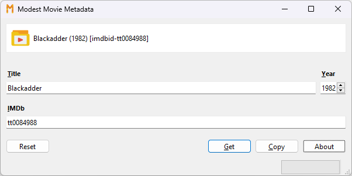

# Modest Movie Metadata

A very simple tool to generate [Jellyfin](https://jellyfin.org/) folder 
names using data from IMDb. By way of example, for the television show 
[Blackadder](https://www.imdb.com/title/tt0084988/), this tool will
generate the folder name `Blackadder (1982) [imdbid-tt0084988]`:

Designed to be as efficient as possible, it can be used hands-free:

1. Monitors the clipboard for IMDb IDs, e.g. within a URL. 
2. Automatically writes generated folder names to the clipboard.

If you prefer, you can enter only the title and year, and attempt to look 
up the IMDB ID using this tool. However, in practice, it is typically easier to 
search for the content on the IMDb website using a web browser, and then simply 
copy the URL to the clipboard.

The program does not create or monitor folders on the file system. 

Developed with Python 3.12 and PySide 6.6. Tested under Windows 10 and 11.

This project is not affiliated with Jellyfin or IMDb.

## Licence
GPL 3.0 or later.

## Author

- [@damonlynch](https://www.github.com/damonlynch)

## Credits

- Program icon created by [Smashicons - Flaticon](https://www.flaticon.com/free-icon/letter-m_6431117).
- Video folder icon created by [Smashicons - Flaticon](https://www.flaticon.com/free-icon/video_6302563).
- Sound effects from [Pixabay](https://pixabay.com/sound-effects/game-ui-sounds-14857/). 
