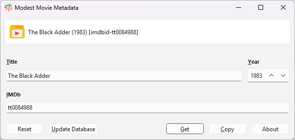

# Modest Movie Metadata

  [![GitButler](https://img.shields.io/badge/GitButler-%23B9F4F2?logo=data%3Aimage%2Fsvg%2Bxml%3Bbase64%2CPHN2ZyB3aWR0aD0iMzkiIGhlaWdodD0iMjgiIHZpZXdCb3g9IjAgMCAzOSAyOCIgZmlsbD0ibm9uZSIgeG1sbnM9Imh0dHA6Ly93d3cudzMub3JnLzIwMDAvc3ZnIj4KPHBhdGggZD0iTTI1LjIxNDUgMTIuMTk5N0wyLjg3MTA3IDEuMzg5MTJDMS41NDI5NSAwLjc0NjUzMiAwIDEuNzE0MDYgMCAzLjE4OTQ3VjI0LjgxMDVDMCAyNi4yODU5IDEuNTQyOTUgMjcuMjUzNSAyLjg3MTA3IDI2LjYxMDlMMjUuMjE0NSAxNS44MDAzQzI2LjcxOTcgMTUuMDcyMSAyNi43MTk3IDEyLjkyNzkgMjUuMjE0NSAxMi4xOTk3WiIgZmlsbD0iYmxhY2siLz4KPHBhdGggZD0iTTEzLjc4NTUgMTIuMTk5N0wzNi4xMjg5IDEuMzg5MTJDMzcuNDU3MSAwLjc0NjUzMiAzOSAxLjcxNDA2IDM5IDMuMTg5NDdWMjQuODEwNUMzOSAyNi4yODU5IDM3LjQ1NzEgMjcuMjUzNSAzNi4xMjg5IDI2LjYxMDlMMTMuNzg1NSAxNS44MDAzQzEyLjI4MDMgMTUuMDcyMSAxMi4yODAzIDEyLjkyNzkgMTMuNzg1NSAxMi4xOTk3WiIgZmlsbD0idXJsKCNwYWludDBfcmFkaWFsXzMxMF8xMjkpIi8%2BCjxkZWZzPgo8cmFkaWFsR3JhZGllbnQgaWQ9InBhaW50MF9yYWRpYWxfMzEwXzEyOSIgY3g9IjAiIGN5PSIwIiByPSIxIiBncmFkaWVudFVuaXRzPSJ1c2VyU3BhY2VPblVzZSIgZ3JhZGllbnRUcmFuc2Zvcm09InRyYW5zbGF0ZSgxNi41NzAxIDE0KSBzY2FsZSgxOS44NjQxIDE5LjgzODMpIj4KPHN0b3Agb2Zmc2V0PSIwLjMwMTA1NiIgc3RvcC1vcGFjaXR5PSIwIi8%2BCjxzdG9wIG9mZnNldD0iMSIvPgo8L3JhZGlhbEdyYWRpZW50Pgo8L2RlZnM%2BCjwvc3ZnPgo%3D)](https://gitbutler.com/)  

A very simple tool to generate [Jellyfin](https://jellyfin.org/) folder names using data made freely available by IMDb. By way of example, for the television show [Black Adder](https://www.imdb.com/title/tt0084988/), this tool will generate the folder name
`The Black Adder (1983) [imdbid-tt0084988]`:

Designed to be as efficient as possible, you use it hands-free:

1. Monitors the clipboard for IMDb IDs, e.g. within a URL.
2. Automatically writes generated folder names to the clipboard.

If you prefer, you can enter only the title and year, and attempt to look up the IMDb ID using this tool. However, in practice, it is typically easier to search for the content on the IMDb website using a web browser, and then simply copy the URL to the clipboard.

The program does not create or monitor folders on the file system.

To function, the program will download a dataset from IMDb, and convert it into a database. The database contains:
1. the title's IMDb ID, e.g. `tt0084988`
2. the primary title, e.g. `The Black Adder`
3. the year the title premiered, e.g. `1983`

At the time of writing, the IMDb dataset has over twelve and a half million titles. It is regularly updated by IMDb. If the program does not recognize an IMDb ID, the program itself will prompt to update its database; you can also manually update it.

Tested under Windows 10 and 11. This project is not affiliated with Jellyfin or IMDb.

## Installation

To install the program on Windows, click on the [Releases link here in GitHub](https://github.com/damonlynch/modest-movie-metadata/releases), and download the installer for the latest version. The installer is only for 64-bit Windows 10 and 11. Installers for version 2 and newer should prompt to remove the previous version before installing the new version.

Modest Movie Metadata should work equally well on Linux and macOS, but to use it you need to know how to install Python packages and run a Python script. If somebody would like to volunteer to produce a macOS installer, I would be delighted (I don't own a Mac myself).

## Build

[PyInstaller](https://pyinstaller.org/en/stable/) is used to create the Windows executable, and [Inno Setup](https://jrsoftware.org/isinfo.php) is used to create the Windows installer.

1. Install [Hatch](https://hatch.pypa.io/latest/)
2. Run `hatch run build`

Tested with Inno Setup  6.7.3.

## License

GPL 3.0 or later.

## Author

- [@damonlynch](https://www.github.com/damonlynch)

## Credits

- Video folder icon created by [Smashicons - Flaticon](https://www.flaticon.com/free-icon/video_6302563).
- Sound effects from [Pixabay](https://pixabay.com/sound-effects/game-ui-sounds-14857/).
